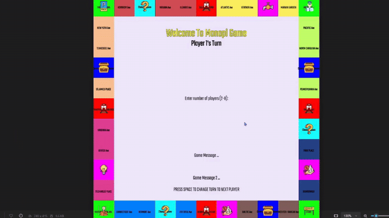

<div align="center">

# 🎮 Monopoly Game 🎲

### A C++ implementation of the classic Monopoly board game using SFML graphics library

[](https://isocpp.org/) 
[](https://www.sfml-dev.org/) 
[](https://www.microsoft.com/windows) 
[]()

</div>

<p align="center">
  
</p>

## 🎯 Game Overview

This Monopoly game is a digital recreation of the classic board game where players roll dice, move around the board, buy properties, collect rent, and try to bankrupt their opponents. The game features a graphical user interface built with SFML, allowing for an interactive and visually appealing gameplay experience.

## ✨ Features

- 👥 Support for 2-8 players
- 🏢 Classic Monopoly board with properties, railroads, utilities, and special squares
- 🏠 Property management (buying properties, upgrading with houses/hotels)
- 🎭 Chance and Community Chest cards
- 🔒 Jail mechanics
- 💸 Bankruptcy system
- 🔄 Dynamic player turns
- 🎵 Background music
- 🎲 Visual dice rolling
- 📊 Property status display

## 🧩 Game Components

- **🏦 Board**: 11x11 grid representing the Monopoly game board
- **👤 Players**: Each with their own money, properties, and position on the board
- **🏘️ Properties**: Streets (with color groups), Railroads, Utilities (Water and Electric companies)
- **🎯 Special Squares**: GO, Jail, Free Parking, Go To Jail, Chance, Community Chest, Tax

## 🎲 How to Play

<div align="center">

| Step | Action |
|:---:|:---|
| 1 | Launch the game |
| 2 | Enter the number of players (2-8) |
| 3 | Each player takes turns rolling the dice by clicking the 'Roll Dice' button |
| 4 | Move around the board based on dice roll |
| 5 | Land on properties to buy them or pay rent to other players |
| 6 | Draw Chance or Community Chest cards when landing on those squares |
| 7 | Pay taxes when landing on Tax squares |
| 8 | Go to Jail when landing on the Go To Jail square or rolling three doubles in a row |
| 9 | Press SPACE to end your turn and move to the next player |
| 10 | The last player with money remaining wins! |

</div>

## 🎮 Game Controls

<table align="center">
  <tr>
    <th>Control</th>
    <th>Action</th>
  </tr>
  <tr>
    <td>🖱️ <b>Mouse Click</b></td>
    <td>Interact with buttons and make selections</td>
  </tr>
  <tr>
    <td>⌨️ <b>Keyboard Input</b></td>
    <td>Enter number of players at the start</td>
  </tr>
  <tr>
    <td>🔠 <b>Space Bar</b></td>
    <td>End current player's turn and move to the next player</td>
  </tr>
  <tr>
    <td>📊 <b>Status Button</b></td>
    <td>View detailed player information</td>
  </tr>
</table>

## 📋 Requirements

<table align="center">
  <tr>
    <td align="center"></td>
    <td>Windows operating system</td>
  </tr>
  <tr>
    <td align="center"></td>
    <td>SFML 2.6.1 library</td>
  </tr>
  <tr>
    <td align="center"></td>
    <td>C++ compiler (g++ recommended)</td>
  </tr>
</table>

## 🔧 Installation and Setup

### 📝 Prerequisites

1. Install a C++ compiler (MinGW with g++ is recommended for Windows)
2. Install SFML 2.6.1 library

### 📥 Installing SFML

1. Download SFML 2.6.1 from the [official website](https://www.sfml-dev.org/download.php)
2. Extract the files to a location on your computer

### 🚀 Compiling and Running the Game

#### 💿 Method 1: Using the provided executable

The simplest way to run the game is to use the provided executable:

1. Navigate to the game directory
2. Run `monopol.exe`

#### 💻 Method 2: Compiling from source

1. Clone or download this repository
2. Open a terminal/command prompt in the project directory
3. Update the makefile with your SFML installation paths:
   - Edit the `INCLUDE_PATH` and `LIBRARY_PATH` variables to point to your SFML installation
4. Compile the game using the makefile:
   ```
   make all
   ```
5. Run the game:
   ```
   main.exe
   ```

## 🔍 Troubleshooting

<table align="center">
  <tr>
    <th>Issue</th>
    <th>Solution</th>
  </tr>
  <tr>
    <td>⚠️ Missing DLL errors</td>
    <td>Ensure all the required SFML DLLs are in the same directory as the executable</td>
  </tr>
  <tr>
    <td>⛔ Compilation fails</td>
    <td>Check that your SFML paths in the makefile are correct</td>
  </tr>
  <tr>
    <td>📥 Assets not loading</td>
    <td>Verify that the Audio and Fonts directories are in the correct location</td>
  </tr>
</table>

## 👏 Credits

<div align="center">

This Monopoly game was created as a final project for Systems Programming 2 course.

</div>


<hr>

<i>README last updated: June 2025</i>

</div>
